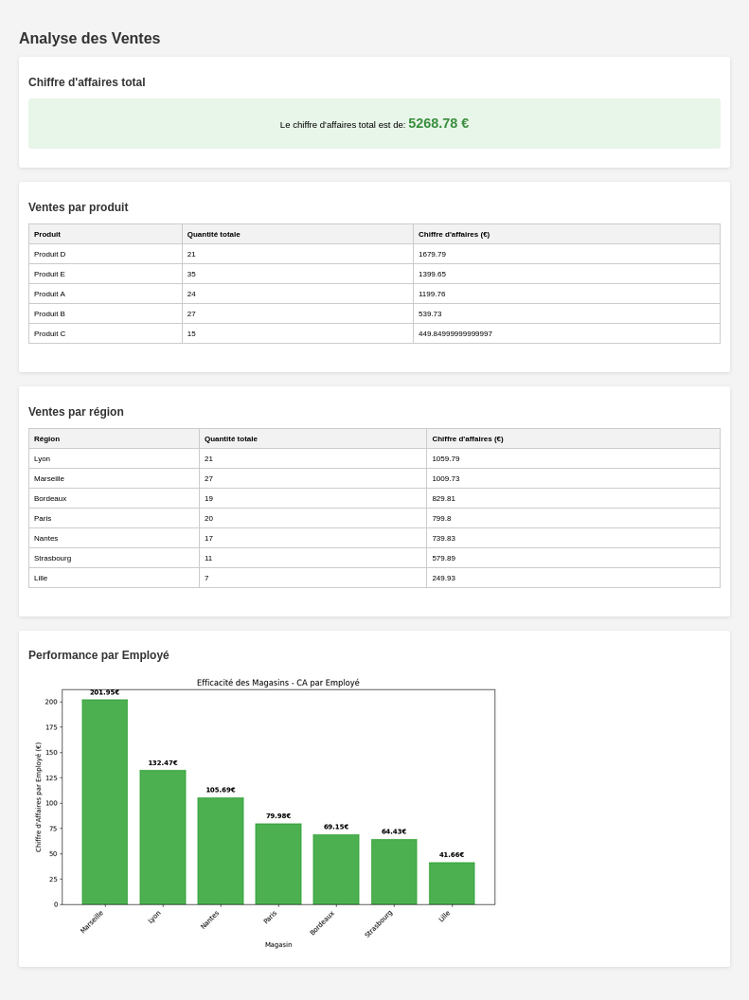

# FastAPI SQLite Sales Analysis Project

Ce projet met en place une application FastAPI qui analyse les données de ventes d'une entreprise en utilisant SQLite. L'application récupère les données depuis des URLs spécifiées, les charge dans une base de données SQLite conteneurisée, effectue des analyses et stocke les résultats. L'ensemble est orchestré avec Docker Compose pour simplifier le déploiement.

## Architecture de l'Application

L'architecture repose sur deux conteneurs orchestrés par Docker Compose :
- Un conteneur **SQLite** dédié qui gère la base de données
- Un conteneur **FastAPI** qui héberge l'application web et la logique métier

Lors du démarrage de l'application FastAPI (`startup_event` dans `main.py`):
1. L'application attend que la base de données SQLite soit disponible (condition healthcheck)
2. Les tables sont initialisées (`initialize_tables` dans `core/database.py`)
3. Les données des produits, magasins et ventes sont récupérées depuis Google Sheets (`import_all_data` dans `gdrive/importers.py`)
4. Une analyse initiale des données est effectuée (`run_analysis` dans `services/analysis.py`)
5. Les résultats de l'analyse sont stockés dans des tables dédiées

```text
+-------------------------------------------------+
| External Data Sources (Google Sheets URLs)      |
+---------------------+-------------------------+
                      | (HTTP GET at startup/refresh)
                      |
+---------------------v-----------------------------+
|  Docker Compose Environment                       |
|                                                   |
| +---------------+          +-------------------+  |
| |               |          |                   |  |
| | SQLite        |<-------->| FastAPI App       |  |
| | Container     |  shared  | Container         |  |
| | (/data)       |  volume  | (/app)            |  |
| |               |          |                   |  |
| +---------------+          +-------------------+  |
|                                    |              |
|                                    | (HTTP)       |
|                                    v              |
|                            Web Browser/API Client |
+---------------------------------------------------+
```

## Structure du Projet

```sh
simplon_7
|
├── docker-compose.yaml       # Configuration des conteneurs Docker
├── README.md
|
├── data/                     # Volume partagé pour la base SQLite
│   └── sales.db
|
└── app
    ├── main.py               # Point d'entrée de l'application
    ├── requirements.txt
    ├── Dockerfile
    │
    ├── core/
    │   ├── config.py         # Configuration de l'application
    │   └── database.py       # Utilitaires d'accès à la base de données
    │
    ├── gdrive/               # Importation depuis Google Drive
    │   ├── importers.py      # Logique d'import des données
    │   └── schemas.py        # Schémas des données importées
    │
    ├── models/
    │   └── tables.py         # Définitions des tables et requêtes SQL
    │
    ├── routes/
    │   ├── api.py            # Endpoints API REST
    │   └── web.py            # Routes pour le dashboard
    │
    ├── services/
    │   ├── analysis.py       # Service d'analyse des données
    │   └── visualization.py  # Génération de graphiques
    │
    └── templates/
        └── analysis.html     # Dashboard d'analyse
```

## Diagramme Entité-Relation (ERD) - Tables Principales

```text
+--------------------------+       +--------------------------+
|         PRODUITS         |       |         MAGASINS         |
+--------------------------+       +--------------------------+
| PK id_reference_produit  |       | PK id_magasin            |
|    nom                   |       |    ville                 |
|    prix                  |       |    nombre_de_salaries    |
|    stock                 |       +--------------------------+
+-----------|--------------+                 |
            |                                |
            | 1                              | 1
            |                                |
           / \                              / \
          /   \                            /   \
         /     \                          /     \
        /       \                        /       \
+------(contient)-------+      +------(enregistre)-------+
|         VENTES         |      |         VENTES         |
+--------------------------+      +--------------------------+
|    date                  |      |    date                  |
| FK id_reference_produit  |      | FK id_reference_produit  |
| FK id_magasin            |      | FK id_magasin            |
|    quantite              |      |    quantite              |
+--------------------------+      +--------------------------+
(Note: 1-to-Many relationships shown)
```

## Structure Complète de la Base de Données

### Tables de Données Principales
1. **produits**
   - `id_reference_produit` (TEXT): Identifiant unique du produit
   - `nom` (TEXT): Nom du produit
   - `prix` (REAL): Prix unitaire
   - `stock` (INTEGER): Quantité en stock

2. **magasins**
   - `id_magasin` (INTEGER): Identifiant unique du magasin
   - `ville` (TEXT): Ville où se situe le magasin
   - `nombre_de_salaries` (INTEGER): Nombre d'employés du magasin

3. **ventes**
   - `date` (TEXT): Date de la vente
   - `id_reference_produit` (TEXT): Référence au produit vendu
   - `quantite` (INTEGER): Quantité vendue
   - `id_magasin` (INTEGER): Magasin où la vente a eu lieu

### Tables d'Analyse
Ces tables sont générées par l'application lors de l'analyse des données:

1. **chiffre_affaires_total**
   - `date_analyse` (TEXT, PK): Date à laquelle l'analyse a été effectuée
   - `montant_total` (REAL): Chiffre d'affaires total calculé

2. **ventes_par_produit**
   - `date_analyse` (TEXT, PK): Date de l'analyse
   - `nom_produit` (TEXT, PK): Nom du produit analysé
   - `quantite_totale` (INTEGER): Quantité totale vendue
   - `chiffre_affaires` (REAL): Chiffre d'affaires généré par ce produit

3. **ventes_par_region**
   - `date_analyse` (TEXT, PK): Date de l'analyse
   - `region` (TEXT, PK): Ville/région analysée
   - `quantite_totale` (INTEGER): Quantité totale vendue dans cette région
   - `chiffre_affaires` (REAL): Chiffre d'affaires généré dans cette région

Le système stocke les résultats de chaque analyse avec un horodatage, permettant de suivre l'évolution des performances dans le temps.

## Instructions d'Installation

1. **Cloner le dépôt:**
   ```bash
   git clone https://github.com/Hatchi-Kin/simplon_7.git
   cd simplon_7
   ```

2. **Construire et lancer l'application avec Docker Compose:**
   ```bash
   docker compose build
   docker compose up
   ```
   *Au premier lancement, le conteneur db crée la base de données et l'app télécharge les données depuis les URLs.*

3. **Accéder à la documentation interactive FastAPI:**
   Ouvrez votre navigateur et naviguez vers `http://localhost:8000/docs`.

## Utilisation

- **Dashboard d'analyse des ventes:**
  Accédez aux résultats d'analyse en naviguant vers `http://localhost:8000/web/dashboard`.

- **Voir le schéma de la base de données:**
  Effectuez une requête GET à `http://localhost:8000/api/schema`.

- **Exécuter des requêtes SQL personnalisées:**
  Envoyez des requêtes SQL via une requête POST à `http://localhost:8000/api/query`.
  Exemple : `{"query": "SELECT * FROM ventes_par_produit ORDER BY chiffre_affaires DESC"}`

- **Relancer l'analyse manuellement:**
  Envoyez une requête POST à `http://localhost:8000/api/run-analysis`.

## Fonctionnalités d'Analyse

L'application effectue les analyses suivantes et stocke les résultats:

1. **Chiffre d'affaires total de l'entreprise**
   - Calcule la somme totale des ventes
   - Stocké dans `chiffre_affaires_total`

2. **Analyse des ventes par produit**
   - Affiche pour chaque produit les quantités vendues et le chiffre d'affaires généré
   - Stocké dans `ventes_par_produit`

3. **Analyse des ventes par région (ville)**
   - Présente les performances agrégées par ville
   - Stocké dans `ventes_par_region`

4. **Performance par employé**
   - Visualisation graphique du ratio chiffre d'affaires/nombre d'employés par magasin
   - Généré dynamiquement lors de l'affichage du dashboard

## Architecture Technique

### Conteneurs Docker
- **db**: Conteneur SQLite qui initialise et maintient la base de données
- **app**: Conteneur FastAPI qui gère la logique métier et l'interface utilisateur

### Base de Données
La base SQLite est créée dans le conteneur db et partagée avec le conteneur app via un volume Docker. Le conteneur app attend que la base soit disponible avant de démarrer (healthcheck).

### Importation des Données
Les données sont importées depuis des URLs externes (Google Sheets) et transformées avant d'être stockées dans la base SQLite. Pour les ventes, l'importation est incrémentale (seules les nouvelles données sont ajoutées).

## Screenshot

